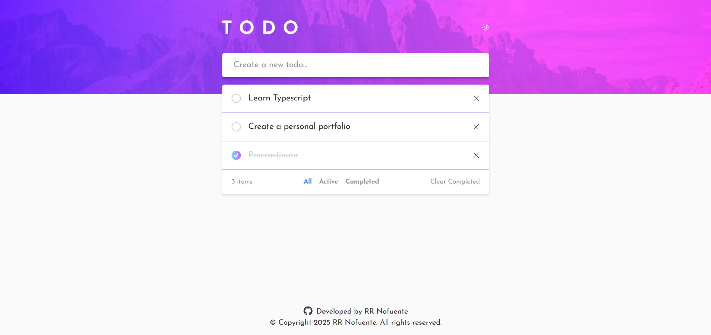
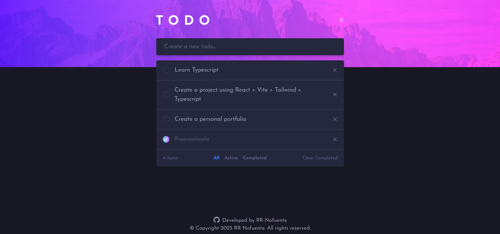
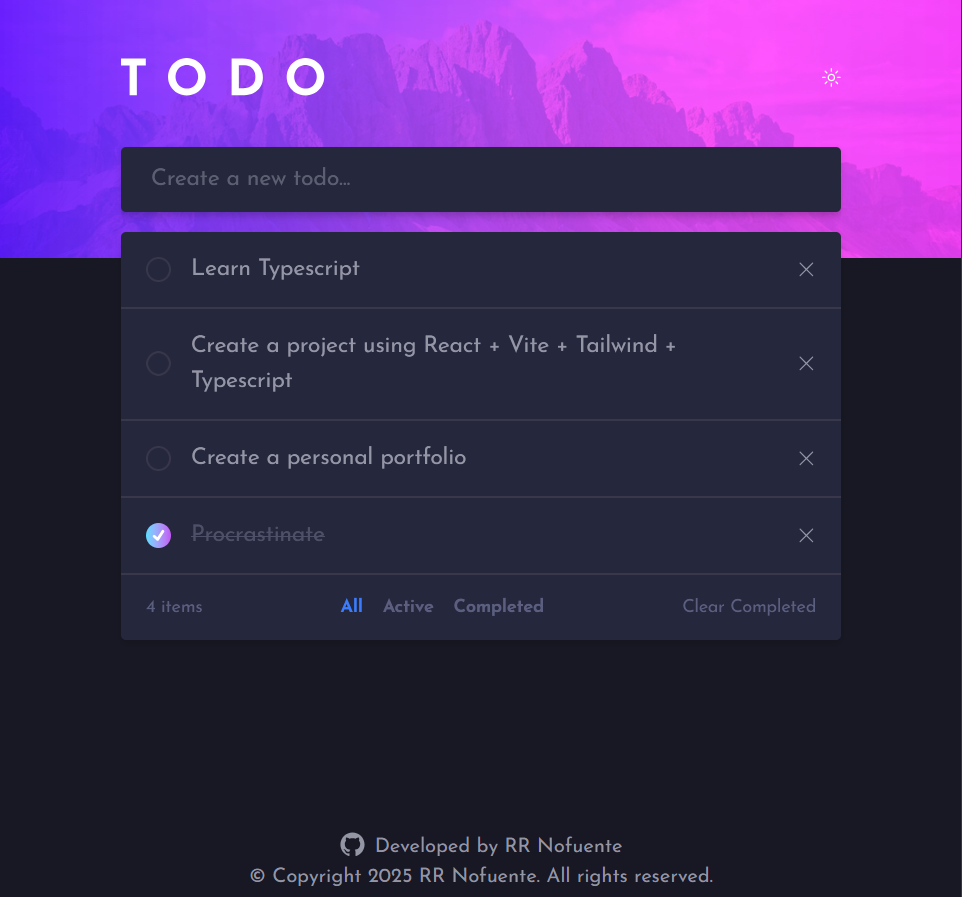
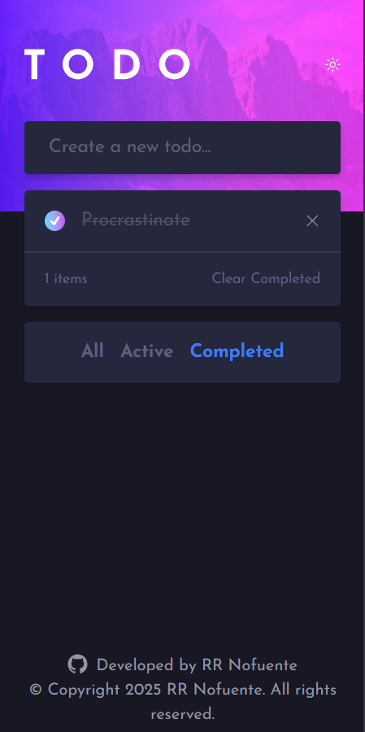

## Project Source here
Frontend Mentor
# Project Title here
Todo App

Todo App is a simple app that lets you create, read, toggle between done and not done, and delete todos.

### Features
- Create, read, update, and delete todos
- Filter select between all, active, and completed todos
- Theme toggle between dark and light mode
- Responsive across multiple screen sizes

### Built With
- React + Vite
- Tailwind CSS
- Radix UI (components and icons)
- Zustand (global state management and persistence)
- React Hook Form (add todo input)

### Getting Started
In order to setup and work on this project on your own, you will need to:

Clone this project: 
`git clone https://github.com/nofuenterr/insert-git-repo-name-here.git`

Once you have cloned this project, you can install the required dependencies by using: 
`npm install`

A live demo of the project can be started by using: 
`npm run preview`

Distribution files can be produced using: 
`npm run build`

### Credits/Acknowledgments
This project is for personal use only. I do not own any of the rights for the assets used in this project.

### Display
#### Desktop: light mode

#### Desktop: dark mode

#### Tablet

#### Phone

### To-do
- [ ] Automatically remove todo when toggling them on an active filter that isn't 'All'
- [ ] Edit todo titles
- [ ] More noticeable buttons/icons
- [ ] Drag and drop feature to reorder list
- [ ] Fix checkbox size warping when todo title is lengthy
- [ ] Add animations

---

Developed by **RR Nofuente**
