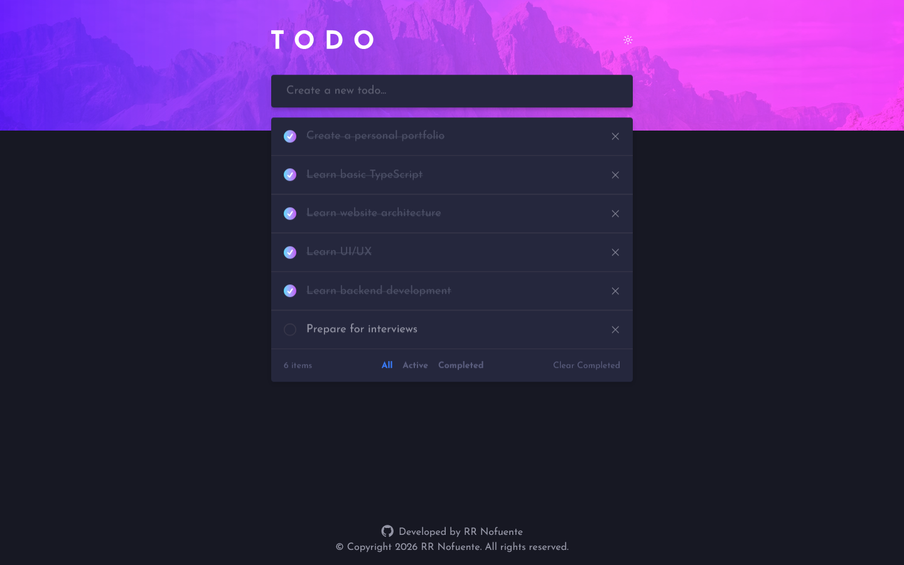
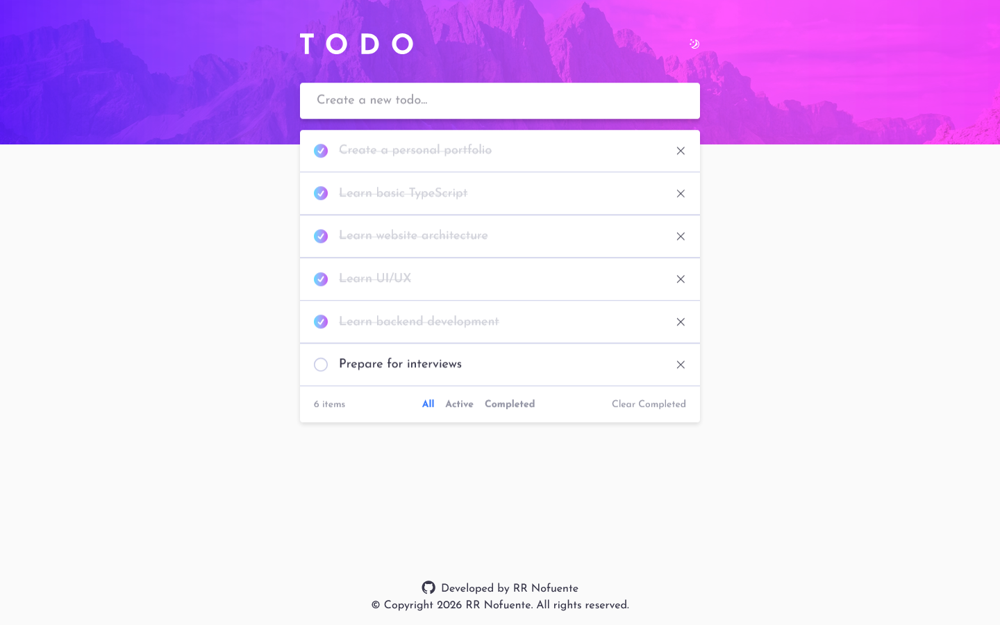
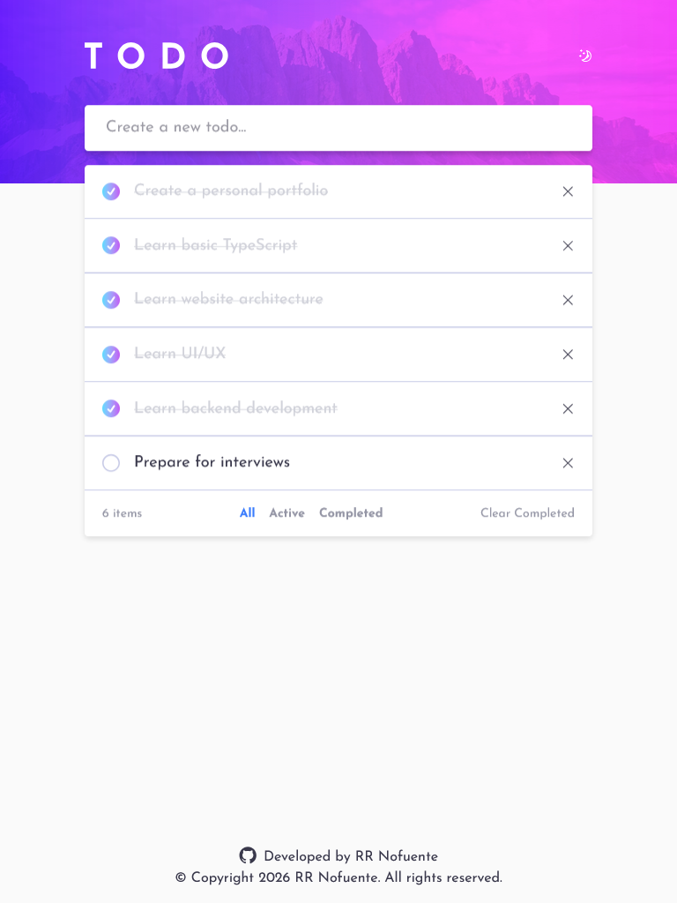
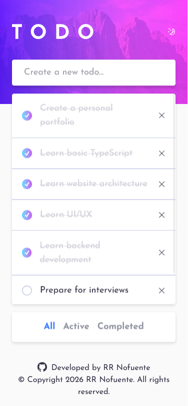
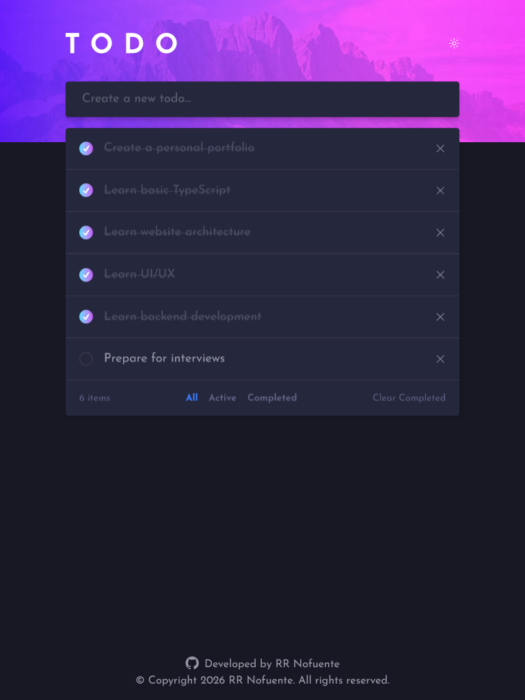
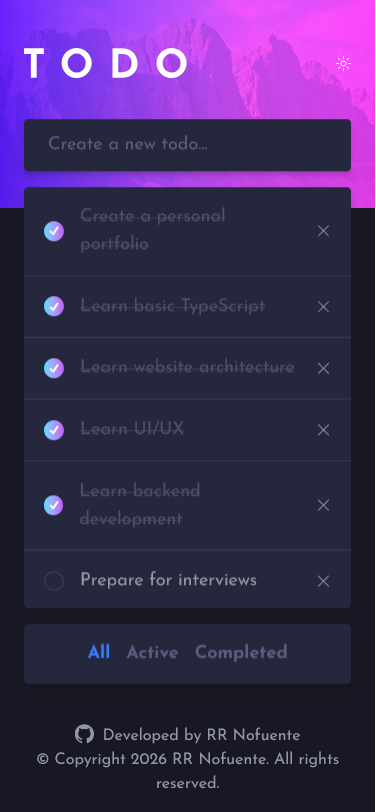

# Todo App

> A simple, clean todo app with filtering, theme toggle, and persistent data.



**Live Demo:** [todo-app-five-jade-30.vercel.app](https://todo-app-five-jade-30.vercel.app)

---

## Overview

Todo App is a Frontend Mentor challenge solution for a classic task manager. Users can add, complete, and delete todos, filter by status (all, active, or completed), and toggle between light and dark mode. Todo data persists across sessions, and the app is fully responsive.

---

## Features

- Create, complete, and delete todos
- Filter by all, active, or completed
- Light and dark theme toggle
- Persistent todo data across sessions
- Responsive layout for mobile, tablet, and desktop

---

## Tech Stack

| Category | Technology |
|---|---|
| Framework | React + Vite |
| Language | TypeScript |
| Styling | Tailwind CSS |
| Forms | React Hook Form |
| UI Components | Radix UI |
| State Management | Zustand |

---

## Getting Started

### Prerequisites

- Node.js `v18+`

### Installation

```bash
git clone https://github.com/nofuenterr/todo-app.git
cd todo-app
npm install
```

### Running the App

```bash
npm run preview
```

### Build

```bash
npm run build
```

---

## Screenshots

### Light Mode
| Desktop | Tablet | Mobile | 
|---|---|---|
|  |  |  |

### Dark Mode
| Desktop | Tablet | Mobile | 
|---|---|---|
|  |  |  |

---

## To-do

- [ ] Fix: empty filter click doesn't update active style
- [ ] Fix: scrollbar visible with no overflow
- [ ] Fix: checkbox size warp on long todo titles
- [ ] Auto-remove todo when toggling on a non-All filter
- [ ] Edit todo titles inline
- [ ] Drag and drop to reorder list
- [ ] More visible action buttons/icons
- [ ] Add animations

---

## Credits

This project is a solution to a [Frontend Mentor](https://www.frontendmentor.io) challenge. I do not own the rights to any assets used.

---

*Developed by **RR Nofuente***